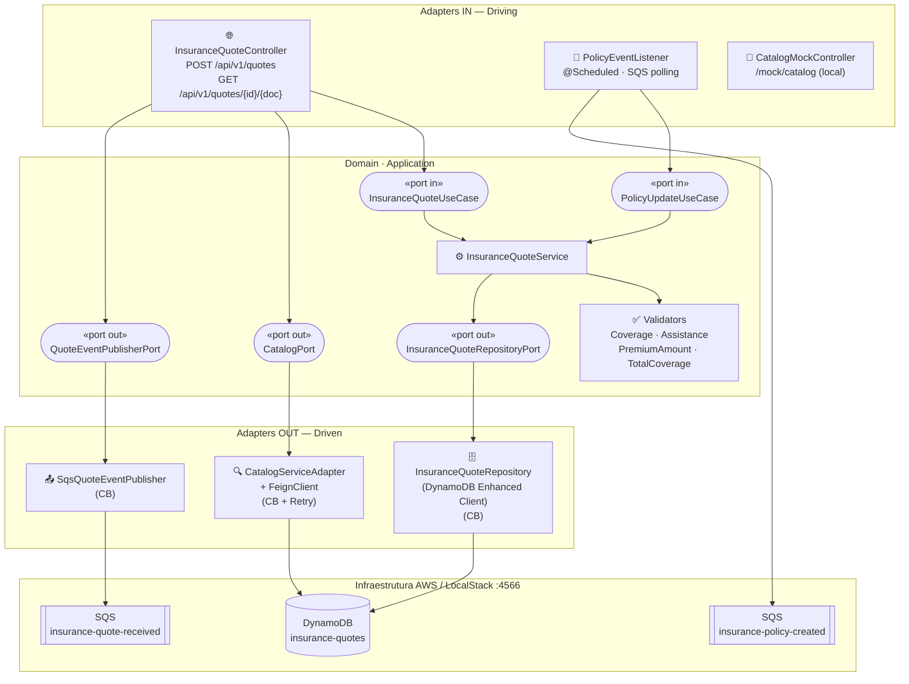
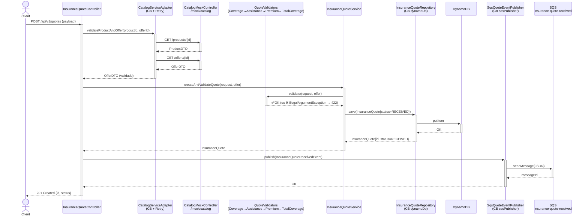
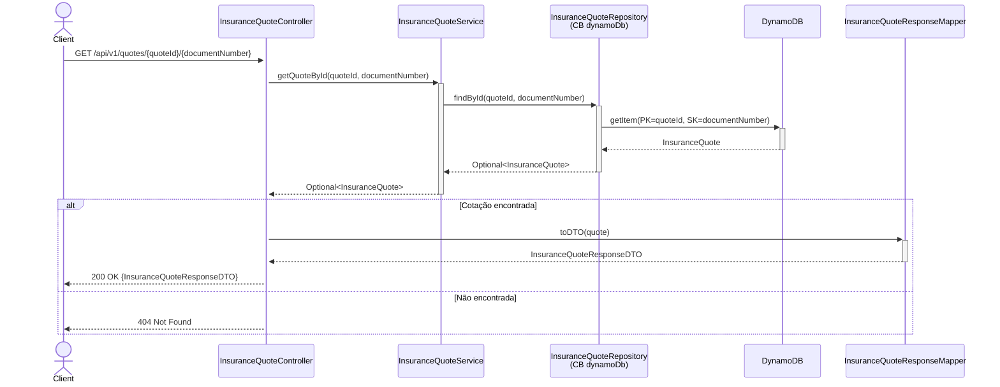
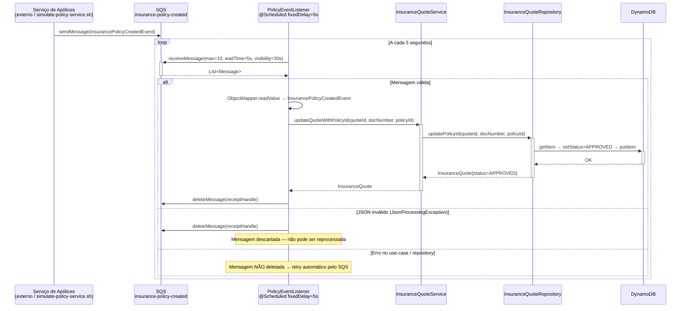
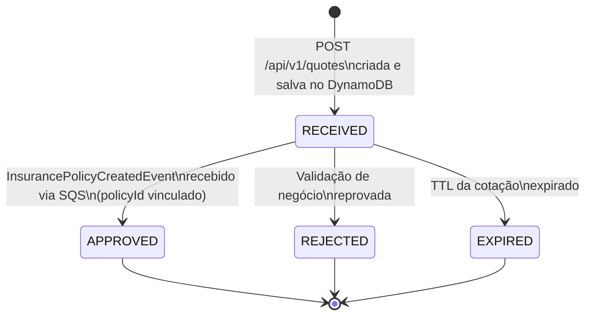
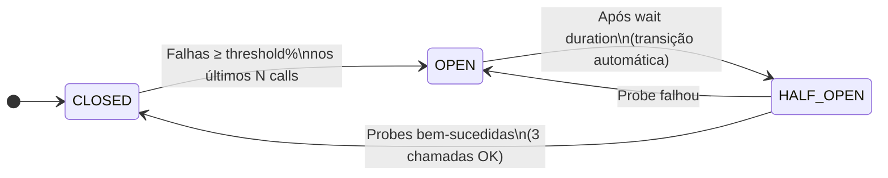
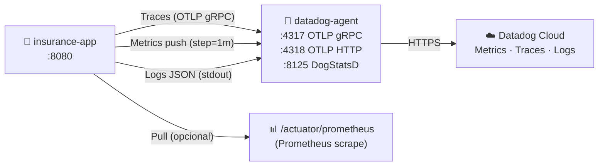
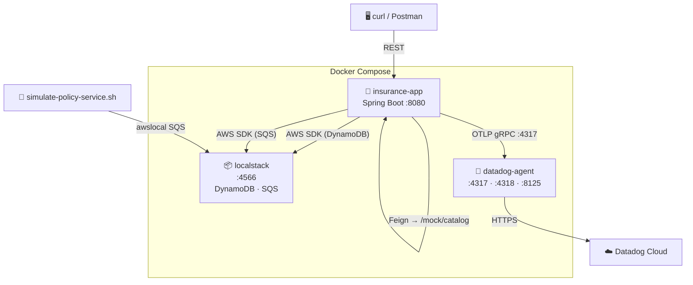

# Insurance Quote Service

Microsserviço de cotações de seguros desenvolvido com **Spring Boot 3.2 + Java 21**, seguindo a **Arquitetura Hexagonal (Ports & Adapters)**. O serviço recebe requisições de cotação via REST, valida contra o catálogo de produtos, persiste no DynamoDB, publica eventos no SQS e consome eventos de apólice para atualizar o status das cotações.

---

## Stack Tecnológica

| Camada | Tecnologia |
|---|---|
| Runtime | Java 21 + Spring Boot 3.2.2 |
| Persistência | AWS DynamoDB (LocalStack em ambiente local) |
| Mensageria | AWS SQS (LocalStack em ambiente local) |
| HTTP Client | Spring Cloud OpenFeign + Caffeine Cache |
| Resiliência | Resilience4j (Circuit Breaker + Retry) |
| Observabilidade | Micrometer + Datadog Agent + OpenTelemetry (OTLP) |
| Testes | JUnit 5 + Mockito + AssertJ |
| Infra local | Docker Compose + LocalStack 3 |

---

## Arquitetura Hexagonal

O domínio central não possui dependências de frameworks ou infraestrutura. Toda comunicação com o exterior ocorre através de **portas** (interfaces) implementadas por **adaptadores**.



---

## Estrutura de Pacotes

```
insurance/src/main/java/br/com/desafio/insurance/
├── adapter/
│   ├── in/
│   │   ├── http/          # InsuranceQuoteController · DTOs · ResponseMapper
│   │   ├── messaging/     # PolicyEventListener (SQS polling @Scheduled)
│   │   └── mock/          # CatalogMockController (catálogo embutido, ambiente local)
│   └── out/
│       ├── catalog/       # CatalogServiceAdapter · CatalogServiceClient (Feign)
│       ├── messaging/     # SqsQuoteEventPublisher · QuoteEventMapper
│       └── persistence/   # InsuranceQuoteRepository (DynamoDB)
├── application/
│   └── InsuranceQuoteService.java   # Implementa InsuranceQuoteUseCase + PolicyUpdateUseCase
├── config/                # Beans: AWS SDK, Feign, Caffeine Cache, Resilience4j
└── domain/
    ├── catalog/           # ProductDTO · OfferDTO · PremiumAmountDTO
    ├── event/             # InsuranceQuoteReceivedEvent · InsurancePolicyCreatedEvent
    ├── exception/         # ServiceUnavailableException
    ├── model/             # InsuranceQuote · Customer · QuoteStatus
    ├── port/
    │   ├── in/            # InsuranceQuoteUseCase · PolicyUpdateUseCase
    │   └── out/           # CatalogPort · InsuranceQuoteRepositoryPort · QuoteEventPublisherPort
    ├── quote/             # InsuranceQuoteRequestDTO · CustomerDTO
    └── validation/        # QuoteValidator (interface) + 4 implementações ordenadas
```

---

## Fluxo: Criação de Cotação

`POST /api/v1/quotes`



---

## Fluxo: Consulta de Cotação

`GET /api/v1/quotes/{quoteId}/{documentNumber}`



---

## Fluxo: Processamento de Apólice (SQS Polling)



---

## Ciclo de Vida de uma Cotação



---

## Resiliência: Circuit Breakers



| Circuit Breaker | Janela | Threshold | Wait Open | Retry |
|---|---|---|---|---|
| `catalogService` | 5 calls | 60 % | 20 s | 2 tentativas · 300 ms |
| `dynamoDb` | 10 calls | 50 % | 30 s | — |
| `sqsPublisher` | 5 calls | 50 % | 30 s | — |

> `IllegalArgumentException` é ignorado por todos os circuit breakers — erros de validação de negócio não contam como falha de infraestrutura.

---

## Observabilidade



### Métricas de Negócio

| Métrica | Tipo | Tags | Descrição |
|---|---|---|---|
| `insurance.quote.created.total` | Counter | `product_id` | Cotações criadas com sucesso |
| `insurance.quote.validation.error.total` | Counter | `reason` | Falhas de validação |
| `insurance.service.unavailable.total` | Counter | `dependency` | Circuit breaker aberto |
| `insurance.policy.updated.total` | Counter | — | Apólices processadas |
| `insurance.catalog.calls.total` | Counter | `outcome` | Chamadas ao catálogo |

### Métricas de Latência (p50 / p95 / p99)

| Métrica | Tag | Descrição |
|---|---|---|
| `insurance.quote.creation.duration` | `outcome` | End-to-end do POST /api/v1/quotes |
| `insurance.quote.get.duration` | `outcome` | End-to-end do GET /api/v1/quotes |
| `insurance.quote.service.creation.duration` | — | Camada de serviço + validadores |
| `insurance.catalog.call.duration` | — | Chamadas HTTP ao catálogo |

Endpoints Actuator disponíveis: `health`, `info`, `metrics`, `prometheus`, `circuitbreakers`, `circuitbreakerevents`.

---

## Infraestrutura Local



### Recursos LocalStack

| Tipo | Nome | Chave |
|---|---|---|
| DynamoDB Table | `insurance-quotes` | PK: `id` (String) · SK: `documentNumber` (String) |
| SQS Queue | `insurance-quote-received` | Eventos publicados pelo serviço |
| SQS Queue | `insurance-policy-created` | Eventos consumidos pelo serviço |

---

## Como Executar

### Pré-requisitos

- Java 21+
- Docker + Docker Compose

### 1. Subir a infraestrutura (LocalStack + Datadog Agent)

```bash
cd insurance
docker compose up -d
```

### 2. Aguardar o LocalStack inicializar (~10 s)

O script `init-localstack.sh` é executado automaticamente pelo LocalStack na inicialização e cria a tabela DynamoDB e as duas filas SQS.

### 3. Executar a aplicação

```bash
cd insurance
./mvnw spring-boot:run
```

A aplicação sobe na porta **8080**. O catálogo mock está disponível em `/mock/catalog`.

### 4. Criar uma cotação

```bash
curl -s -X POST http://localhost:8080/api/v1/quotes \
  -H "Content-Type: application/json" \
  -d '{
    "product_id": "1b2da7cc-b367-4196-8a78-9cfeec21f587",
    "offer_id":   "adc56d77-348c-4bf0-908f-22d402ee715c",
    "category":   "HOME",
    "total_monthly_premium_amount": 75.25,
    "total_coverage_amount": 825000.00,
    "coverages": {
      "Incêndio":                 250000.00,
      "Desastres naturais":       500000.00,
      "Responsabiliadade civil":   75000.00
    },
    "assistances": ["Encanador", "Eletricista", "Chaveiro 24h"],
    "customer": {
      "document_number": "36205578900",
      "name":            "John Wick",
      "type":            "NATURAL",
      "gender":          "MALE",
      "date_of_birth":   "1973-05-02",
      "email":           "johnwick@gmail.com",
      "phone_number":    11950503030
    }
  }'
```

**Resposta:** `201 Created`
```json
{ "id": "<uuid>", "status": "RECEIVED" }
```

### 5. Simular o serviço de apólices (opcional)

```bash
bash simulate-policy-service.sh
```

O script consome a fila `insurance-quote-received` e publica eventos em `insurance-policy-created`, simulando um serviço externo de emissão de apólices. A cotação terá seu status atualizado para `APPROVED`.

---

## API Reference

### `POST /api/v1/quotes` — Criar Cotação

| Status | Situação |
|---|---|
| `201 Created` | Cotação criada; retorna `{ id, status }` |
| `422 Unprocessable Entity` | Falha de validação de negócio |
| `503 Service Unavailable` | Catálogo ou DynamoDB indisponível (circuit breaker aberto) |
| `500 Internal Server Error` | Erro inesperado |

### `GET /api/v1/quotes/{quoteId}/{documentNumber}` — Consultar Cotação

| Status | Situação |
|---|---|
| `200 OK` | Retorna `InsuranceQuoteResponseDTO` completo |
| `404 Not Found` | Cotação não encontrada |
| `503 Service Unavailable` | DynamoDB indisponível (circuit breaker aberto) |

---

## Variáveis de Ambiente

| Variável | Padrão (local) | Descrição |
|---|---|---|
| `CLOUD_AWS_DYNAMODB_ENDPOINT` | `http://localhost:4566` | Endpoint DynamoDB |
| `CLOUD_AWS_FILA_INSURANCE_QUOTE_RECEIVED` | `http://localhost:4566/.../insurance-quote-received` | URL fila SQS de cotações |
| `CLOUD_AWS_FILA_INSURANCE_POLICY_CREATED` | `http://localhost:4566/.../insurance-policy-created` | URL fila SQS de apólices |
| `DATADOG_METRICS_ENABLED` | `false` | Habilita push de métricas para Datadog |
| `DATADOG_API_KEY` | — | API Key do Datadog |
| `DD_API_KEY` | — | API Key do Datadog Agent (docker-compose) |
| `OTEL_EXPORTER_OTLP_ENDPOINT` | `http://localhost:4317` | Endpoint OTLP do Datadog Agent |
| `TRACING_ENABLED` | `true` | Habilita distributed tracing |
| `TRACING_SAMPLE_RATE` | `1.0` | Taxa de amostragem (0.0 – 1.0) |
| `APP_ENV` | `local` | Tag de ambiente (`local`, `staging`, `prod`) |

---

## Testes

```bash
# Executar todos os testes
cd insurance && ./mvnw test

# Executar com relatório de cobertura JaCoCo (target/site/jacoco/index.html)
cd insurance && ./mvnw verify
```

### Suíte de Testes

| Classe de Teste | Estratégia | O que cobre |
|---|---|---|
| `InsuranceQuoteControllerTest` | `@WebMvcTest` + Mockito | Endpoints HTTP, status codes, body de resposta e erro |
| `InsuranceQuoteServiceTest` | Unit (Mockito) | Criação de cotação, cadeia de validators, atualização por apólice |
| `PolicyEventListenerTest` | Unit (Mockito) | Polling SQS, processamento de batch, JSON inválido, falhas de infraestrutura |
| `SqsQuoteEventPublisherTest` | Unit (Mockito) | Publicação SQS, serialização, wrapping de exceção, fallback de circuit breaker |
| `InsuranceQuoteRepositoryTest` | Unit (Mockito) | CRUD DynamoDB, circuit breaker fallbacks |
| `CatalogServiceAdapterTest` | Unit (Mockito) | Validação produto/oferta, retry, circuit breaker, métricas |
| `InsuranceQuoteResponseMapperTest` | Unit | Mapeamento de entidade para DTO de resposta |

---

## Princípios de Design Aplicados

| Princípio | Aplicação |
|---|---|
| **Hexagonal Architecture** | Domínio isolado de frameworks; toda dependência externa via porta/adaptador |
| **DIP** | Adaptadores dependem de interfaces do domínio, nunca o contrário |
| **ISP** | Use-cases separados: `InsuranceQuoteUseCase` e `PolicyUpdateUseCase` são interfaces independentes |
| **SRP** | Cada `QuoteValidator` implementa exatamente uma regra de negócio |
| **OCP** | Novos validadores são adicionados implementando `QuoteValidator` e anotando com `@Order`, sem alterar o serviço |
| **Resiliência** | Circuit Breaker + Retry em todas as integrações externas (Catalog HTTP, DynamoDB, SQS) |
| **Observabilidade** | Métricas de negócio e latência com percentis p50/p95/p99 + distributed tracing via OTLP |

